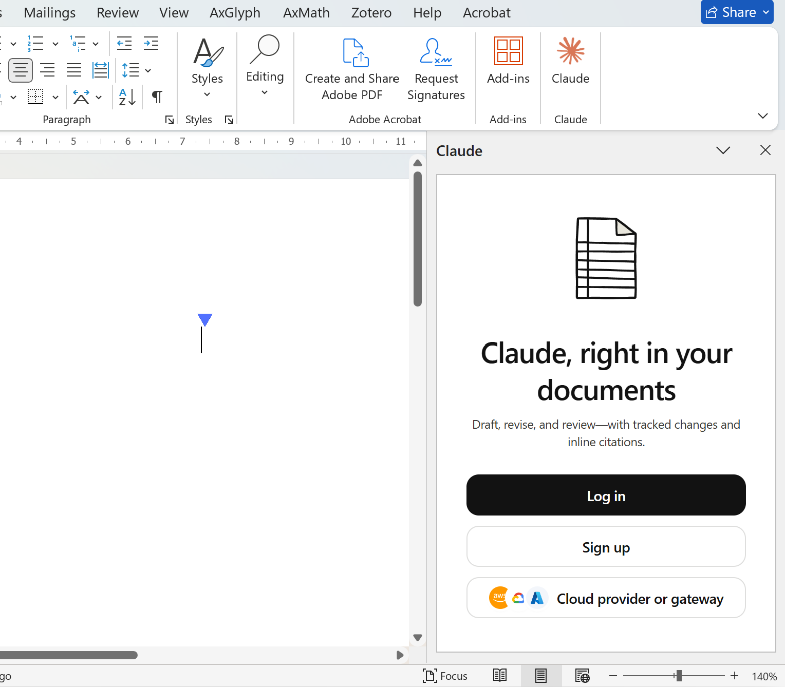
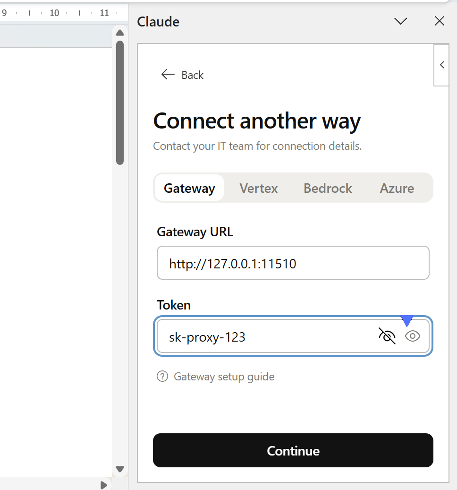
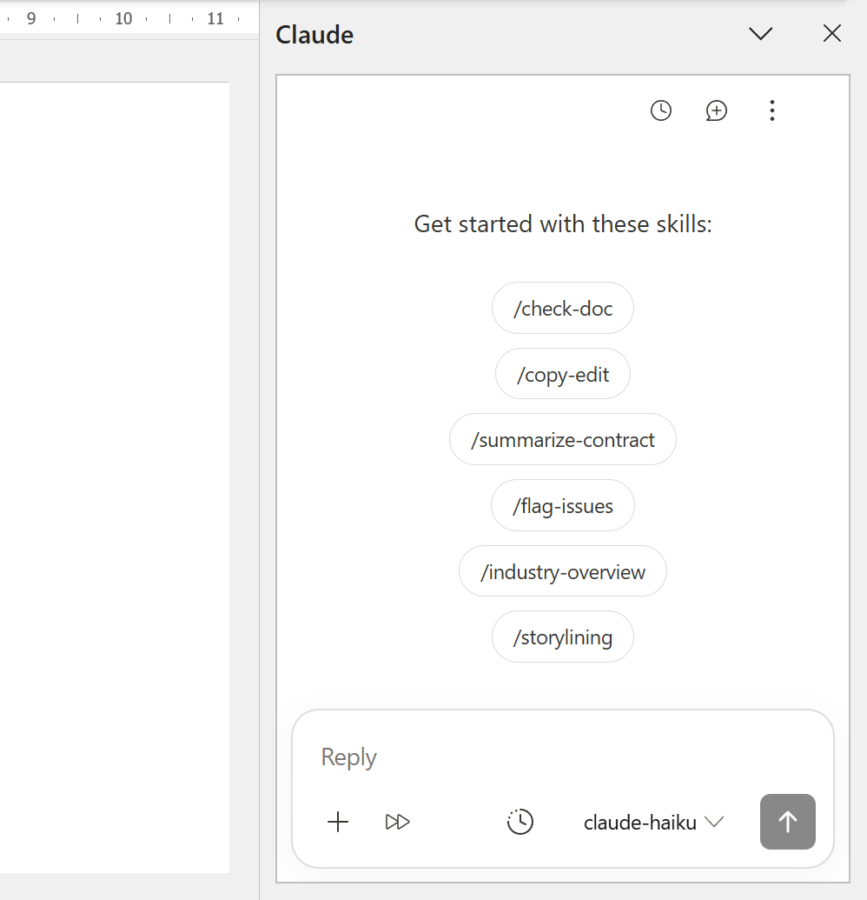

import Tabs from '@theme/Tabs';
import TabItem from '@theme/TabItem';

# Claude for Microsoft 365

[Claude for Microsoft 365](https://marketplace.microsoft.com/en-us/product/office/wa200010725?tab=overview) is Anthropic's official addin for Word, Excel, PowerPoint, and Outlook. By pointing it at a running Tresor instance, you can keep the Anthropic client experience while **hot-switching** the underlying model between Anthropic, DeepSeek, MiniMax, a local `llama.cpp` server, or any other configured downstream — all from the web UI.

No need to worry about the different API format underlying model is using, Tresor will **auto-translate** between the Anthropic API (Claude Desktop) to other API formats (e.g., gpt-5.5 using OpenAI Responses).

This page shows how to wire Claude for Microsoft 365 to Tresor.

## ✅ Prerequisites

- Installed Tresor following [installation guide](/Tresor-docs/docs/user/getting-started/installation).
- [Claude for Microsoft 365](https://marketplace.microsoft.com/en-us/product/office/wa200010725?tab=overview) installed.

## 1. Configure Tresor

There are two ways to prepare Tresor:

### 1.1 Option 1: via Web UI

Web UI is more intuitive, but require more manual operations.

1. In "Downstreams" tab

    - Click <kbd>+ Add Provider</kbd> to add the LLM provider you are about to use.
2. In "Aliases" tab

    - Click <kbd>+ New Alias Group</kbd>
        - Input Model ID: `claude-opus.*`
        - Checked "Regex Pattern"
        - Select the Downstream and Output Model IDs you added previously.
    - Repeat the above add new alias group process to add `claude-sonnet.*` and `claude-haiku.*`
    - Click <kbd>+ Add Name</kbd>:
        - For alias `claude-opus.*`: Add announced name `claude-opus`
        - For alias `claude-sonnet.*`: Add announced name `claude-sonnet`
        - For alias `claude-haiku.*`: Add announced name `claude-haiku`

        > WARNING: Unlike [Claude Code's setup guide](/Tresor-docs/docs/user/llm-apps/claude-code), announced names are **required** to allow Claude for Microsoft 365 to detect available models!

3. In "Settings" tab

    - Click <kbd>+ Add API Key</kbd> under "Proxy Authentication" section (e.g, `sk-proxy-123`). Copy it, and we are about to fill it into `ANTHROPIC_AUTH_TOKEN` in the following section.

### 1.2 Option 2: via `config.yaml`

Editing yaml is less intuitive, but require less manual operations.

The following example `config.yaml` uses 3 downstream providers.
Replace them based on your actual providers.

```yaml title="~/.config/tresor/config.yaml"
bind_addr: 127.0.0.1:11510
proxy_api_keys:
  - sk-proxy-123
... # Omitted showing other settings here
downstreams:
    - id: llama-cpp
      name: llama.cpp
      base_url: http://127.0.0.1:3000 # change to your actual llama.cpp listening port
      api_formats:
        - openai
        - anthropic
      output_model_ids:
        - qwen3.6:27b-mtp-coder
        - qwen3.6:27b-mtp:instruct
    - id: deepseek
      name: DeepSeek
      base_url: https://api.deepseek.com/anthropic
      api_formats:
        - anthropic
      output_model_ids:
        - deepseek-v4-flash
        - deepseek-v4-pro
    - id: minimax
      name: MiniMax
      base_url: https://api.minimaxi.com/anthropic
      api_formats:
        - anthropic
      output_model_ids:
        - MiniMax-M2.5
        - MiniMax-M2.7
        - MiniMax-M3
aliases:
    - input_model_id: claude-opus.*
      is_regex: true
      announced_names:
        - claude-opus
        - claude-opus-5
      options:
        - id: alias-minimax-m3
          downstream_id: minimax
          output_model_id: MiniMax-M3
        - id: alias-deepseek-pro
          downstream_id: deepseek
          output_model_id: deepseek-v4-pro
    - input_model_id: claude-sonnet.*
      is_regex: true
      announced_names:
        - claude-sonnet
        - claude-sonnet-5
      options:
        - id: alias-llama-cpp-qwen-instruct
          downstream_id: llama-cpp
          output_model_id: qwen3.6:27b-mtp:instruct
        - id: alias-deepseek-flash
          downstream_id: deepseek
          output_model_id: deepseek-v4-flash
        - id: alias-minimax-m2-7
          downstream_id: minimax
          output_model_id: MiniMax-M2.7
    - input_model_id: claude-haiku.*
      is_regex: true
      announced_names:
        - claude-haiku
        - claude-haiku-4-5
      options:
        - id: alias-minimax-m2-5
          downstream_id: minimax
          output_model_id: MiniMax-M2.5
```

> If a not-announced name like `claude-opus-4-8` requests Tresor, the most precisely matched alias will still handle it (in this case, `claude-opus.*`). Optional announced names does not limit the capability of regex alias group's model name matching.

Restart Tresor to apply the changes in yaml.


## 2. Configure Claude for Microsoft 365

Launch one of the office apps (Word, Excel, PowerPoint, or Outlook), click <kbd>Cloud provider or gateway</kbd>



In Gateway section:

|Field|Value|
|---|---|
|Gateway URL|http://127.0.0.1:11510
|Token|One of your Tresor API key in proxy_api_keys field (e.g., `sk-proxy-123`)



Click <kbd>Continue</kbd>.
It will test the connectivity of all models that starts with `claude-, so make sure they are reachable.
Once succeeded:



All other office apps will synchronize this setting, so you don't need to configure others one by one.

## 3. Hot-switch from the web UI

Open `http://127.0.0.1:11510` in a browser, go to the **Aliases** tab, and click any sibling option card to make it active.
Claude for Microsoft 365's *next* request will be routed to the new downstream — no restart of either Tresor or Claude for Microsoft 365 is required. 🎉

For example, flip `claude-sonnet` from `deepseek-v4-flash` to `MiniMax-M2.7` with a single click, and the agent immediately starts using MiniMax on the following turn.

## 📚 See also

- [Claude Microsoft 365 Docs](https://claude.com/docs/office-agents/overview)